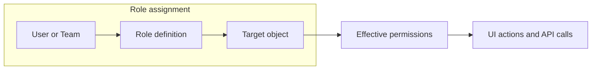
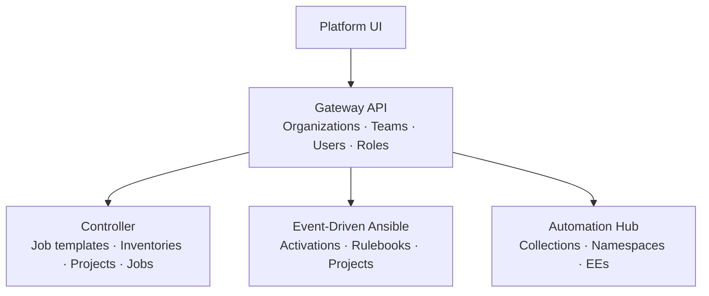
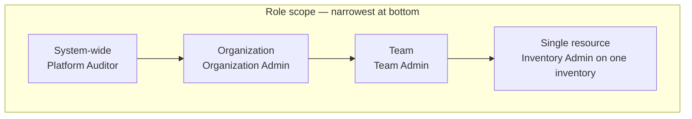
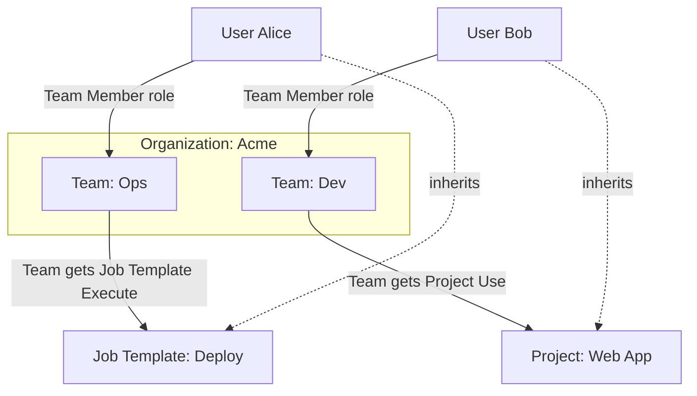
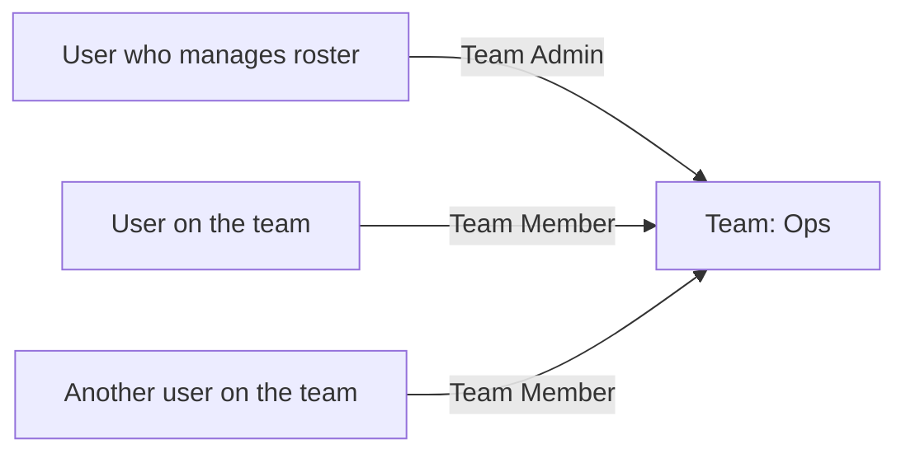
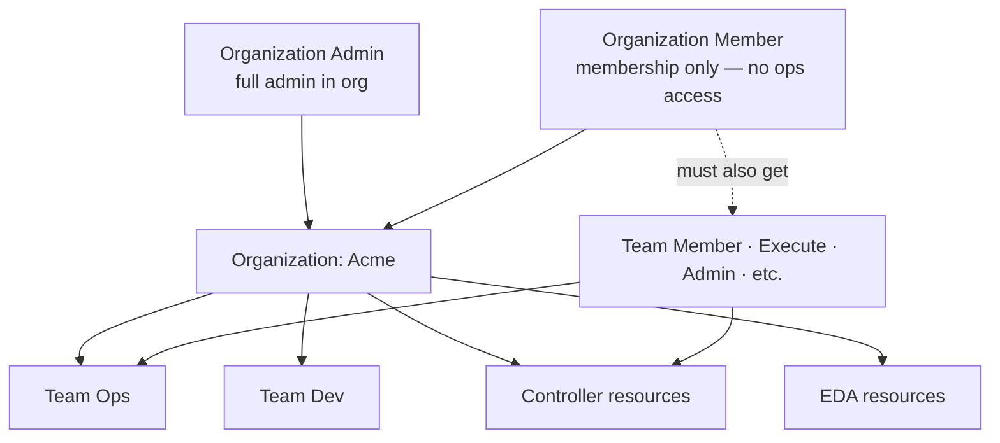
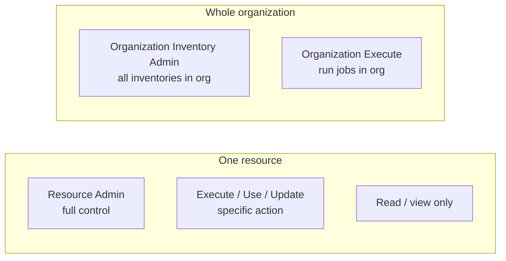
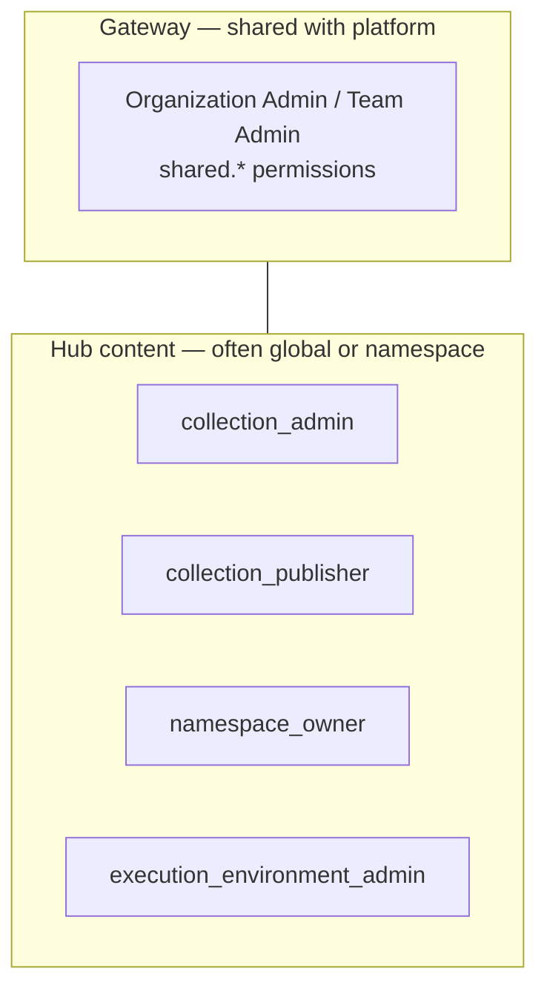
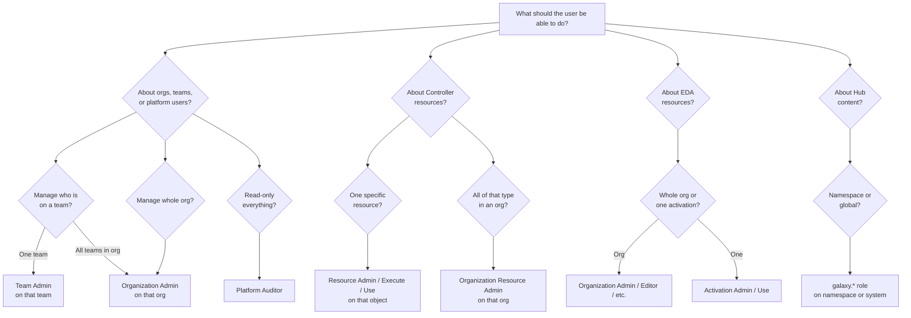

# AAP RBAC — A Human Guide

A practical guide to understanding and configuring access in **Ansible Automation Platform (AAP)**. This companion to [AAP-RBAC-AGENT-CONTEXT.md](./AAP-RBAC-AGENT-CONTEXT.md) favors explanation and diagrams over lookup tables.

---

## The big picture in 60 seconds

AAP answers one question for every action: **“Does this user have permission to do this, on this object?”**

That permission comes from a **role assignment**:

```text
User (or team)  +  Role  +  Object  =  Access
```

- A **role** is a named bundle of permissions (e.g. “Team Admin”).
- An **object** is what the role applies to — a team, an organization, a job template, a namespace, etc.
- Assign roles as **narrowly** as you can. Broader roles are easier to configure but harder to audit.



---

## How the platform is layered

AAP is not one monolithic app. The **Gateway** handles shared identity and access; each **component** owns its own resources.



| Where you click | What you’re managing |
|-----------------|----------------------|
| **Access Management** (Gateway) | Orgs, teams, users, role definitions |
| **Automation Execution** | Controller resources + their Access tabs |
| **Automation Decisions** | EDA resources + Access |
| **Automation Content** | Hub content (often global or namespace-scoped) |

All of this sits on **django-ansible-base (DAB) RBAC** — the same permission engine, with each service registering its resource types.

---

## Four scopes — think “how wide does this role reach?”

Roles apply at one of four scopes. **Pick the smallest scope that fits the job.**



| Scope | Example role | What it means |
|-------|--------------|---------------|
| **System** | Platform Auditor | Read (mostly) across the whole installation |
| **Organization** | Organization Admin | Administer everything inside one org |
| **Team** | Team Admin | Manage one team and who’s on it |
| **Object** | Job Template Execute | Run one specific job template |

**Rule of thumb:** If someone only needs to manage the **Ops** team, give **Team Admin on Ops** — not Organization Admin on the whole org.

---

## Permissions vs roles

You rarely assign raw permissions in the UI. You assign **roles**, which contain permissions.

A permission is written like: `{service}.{action}_{resource}`

| Permission | Plain English |
|------------|---------------|
| `shared.member_team` | Manage membership on a team |
| `shared.view_organization` | View an organization |
| `awx.execute_jobtemplate` | Run a job template |
| `eda.view_activation` | View an activation |
| `galaxy.upload_to_namespace` | Upload collections to a namespace |

**Managed roles** ship with the product (`Organization Admin`, `Team Admin`, `Inventory Admin`, …). **Custom roles** let you pick exact permissions when managed roles are too broad.

---

## Teams — the part that confuses everyone

Teams are a **grouping mechanism**. Permissions granted **to a team** flow to everyone who is a **member** of that team.



### Two different “team” roles

| Role | Who gets it | What it’s for |
|------|-------------|---------------|
| **Team Member** | People who should **be on** the team | Inherit whatever roles the team has been given |
| **Team Admin** | People who **manage** the team | Add/remove members, edit/delete the team, inherit team roles |

**Common mistake:** Giving **Team Member** to someone who needs to **add other users** to the team. Team Member makes them a member; it does not make them a team manager.

**Correct pattern for “manage team membership”:**



---

## Walkthrough: “I want Jane to add and remove users on the Ops team”

### Answer

Assign **Jane → Team Admin → Team “Ops”**.

### Steps in the UI

1. Open **Access Management → Teams**.
2. Open team **Ops**.
3. Go to the **Access** tab.
4. Click **Add roles** (or equivalent).
5. Select user **Jane**.
6. Choose role **Team Admin**.
7. Save.

### Why not these?

| Role | Why it’s wrong for this goal |
|------|------------------------------|
| Team Member | Puts Jane *on* the team; doesn’t grant roster management |
| Organization Member | **Not sufficient alone** — membership marker only; no operational access |
| Platform Auditor | Read-only |

### When Organization Admin is appropriate

Use **Organization Admin** on the parent org only if Jane must admin **all** teams and **all** resources in that org — not just Ops.

### Gotcha: external authentication

If your Controller uses external SSO and `MANAGE_ORGANIZATION_AUTH` is disabled, **Organization Admin** may not be able to change team rosters on Controller-backed teams. **Team Admin on the specific team** still works for that team.

---

## Organizations and membership

> **Organization Member alone does not confer any operational privileges.**  
> Assigning only Organization Member puts a user *in* the org but gives them no ability to run jobs, manage teams, edit resources, or perform other work. It is a **membership marker** so the user can receive other roles (via teams, resource Access tabs, or org-level assignments). Always pair it with the roles that actually grant the capabilities you need.



| Role | Scope | Typical use |
|------|-------|-------------|
| **Organization Admin** | One org | IT lead for that business unit; manage teams, users, and all component resources in the org |
| **Organization Member** | One org | **Membership only** — prerequisite for org association; **must** combine with other roles for any real access |
| **Platform Auditor** | Entire platform | Compliance / read-only oversight |

Organization Admin includes team management permissions for **all teams in that org** — broader than Team Admin on one team.

---

## Controller (Automation Execution)

Controller resources (inventories, projects, job templates, credentials, workflows, etc.) each have familiar role **patterns**:



| You want… | Start with… |
|-----------|-------------|
| Run one job template | **Job Template Execute** on that template |
| Edit one inventory | **Inventory Admin** on that inventory |
| Run ad hoc on one inventory | **Inventory Ad Hoc** on that inventory |
| Admin all projects in an org | **Organization Project Admin** on the org |
| Read-only everything in an org | **Organization Audit** on the org |

Roles are often assigned **to a team** so you maintain one roster instead of many per-user assignments.

**Example workflow**

1. Create team **Deployers**.
2. Give team **Job Template Execute** on template *Deploy App*.
3. Add users to **Deployers** with **Team Member** on that team.
4. All members can run the template.

---

## Event-Driven Ansible (EDA)

EDA uses the same org/team model via the Gateway, plus **EDA-specific org roles**:

| Role | Summary |
|------|---------|
| Organization Admin | Full EDA control in the org |
| Organization Editor | Create/edit (limited delete) |
| Organization Contributor | Edit + enable/disable/restart activations |
| Organization Operator | View + control activations |
| Organization Auditor / Viewer | Read-only in the org |

Individual activations also have **Activation Admin** and **Activation Use** roles for tighter scope.

---

## Automation Hub

Hub is slightly different: **collections and namespaces** are often scoped **globally** or to a **namespace object**, not to a Platform organization.



| You want… | Look at… |
|-----------|----------|
| Publish to a namespace | **galaxy.collection_namespace_owner** on that namespace |
| Curate/sync from remotes | **galaxy.collection_curator** (global) |
| Manage all content | **galaxy.content_admin** (global) |
| Hub user administration | **galaxy.user_admin** (global) |

Check whether your deployment ties Hub content to orgs; many roles are still **system-wide** in practice.

---

## Custom roles — when built-in roles don’t fit

Use custom roles when managed roles grant **too much** (e.g. you only want view + one special action).

1. **Access Management → Roles → Create**
2. Pick a **resource type** (content type) — this sets scope.
3. Select **permissions** from the allowed list.
4. Assign the new role to users or teams on specific objects.

**Restrictions worth knowing**

- You cannot put `member_team` in a **system-wide** custom role.
- Prefer managed roles unless you have a clear least-privilege requirement.

---

## Decision flowchart — “Which role do I need?”



---

## Where to click — quick reference

| Task | Navigation |
|------|------------|
| Define custom roles | Access Management → **Roles** |
| Org-level access | Access Management → **Organizations** → {org} → **Access** |
| Team-level access | Access Management → **Teams** → {team} → **Access** |
| Resource access | Open resource → **Access** tab |
| See who has access | Object’s **Access** tab or role assignment lists |

---

## Common mistakes

| Mistake | Fix |
|---------|-----|
| **Organization Member assigned expecting access** | Organization Member alone grants **no operational privileges** — add Team Member + resource roles, or a role that grants the needed capability |
| Team Member assigned to a “team manager” | Use **Team Admin** on the team |
| Organization Admin for a single-team need | Use **Team Admin** on that team |
| User can’t run a job template | Assign **Execute** on the template (directly or via team) |
| Role assigned but no effect | Check **scope** — org role vs object role; confirm correct org/team/object |
| Confusion after SSO migration | Check `MANAGE_ORGANIZATION_AUTH` for org-admin team changes |
| Hub role on org doesn’t affect namespace | Hub content may need **galaxy.*** roles on the namespace or globally |

---

## Glossary

| Term | Meaning |
|------|---------|
| **Role definition** | Named set of permissions; what the UI calls a “role” |
| **Assignment** | Linking a user or team to a role on an object |
| **Managed role** | Built-in role; don’t edit in production |
| **Content type** | What kind of object a role applies to (`shared.team`, `awx.inventory`, …) |
| **Organization Member** | Built-in role with only membership permissions — **no operational access by itself**; combine with team or resource roles |
| **Member permission** | `member_team` / `member_organization` — marks membership for inheritance; not an operational capability on its own |
| **Gateway** | Central API for orgs, teams, users, and unified RBAC |
| **DAB** | django-ansible-base — shared RBAC library |

---

## Related documents

| Document | Audience |
|----------|----------|
| [AAP-RBAC-GUIDE.md](./AAP-RBAC-GUIDE.md) | Humans — concepts, diagrams, walkthroughs |
| [AAP-RBAC-ROLE-HIERARCHY.md](./AAP-RBAC-ROLE-HIERARCHY.md) | Humans — full role tree from superuser to object roles |
| [AAP-RBAC-MANAGED-ROLES-CATALOG.md](./AAP-RBAC-MANAGED-ROLES-CATALOG.md) | Humans & agents — every built-in role and permissions |
| [AAP-RBAC-AGENT-CONTEXT.md](./AAP-RBAC-AGENT-CONTEXT.md) | AI agents — goal lookup, API reference, decision guidance |

Official Red Hat documentation: search for **“assembly-gw-roles”** in AAP access management docs.

---

## Keeping this guide accurate

Managed roles and permissions change between AAP releases. When upgrading, spot-check:

- Access Management → Roles (managed role list)
- `GET /api/gateway/v1/role_definitions/` on your environment

Source repos used to build these notes are listed in [README.md](./README.md).
