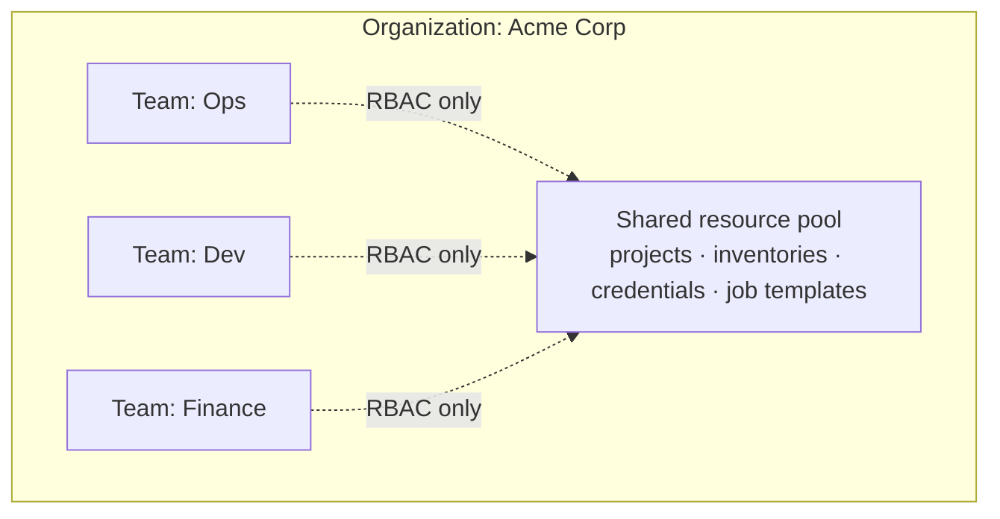
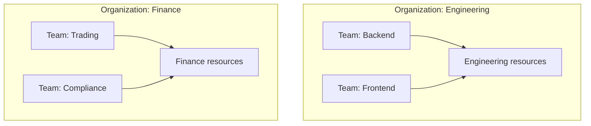
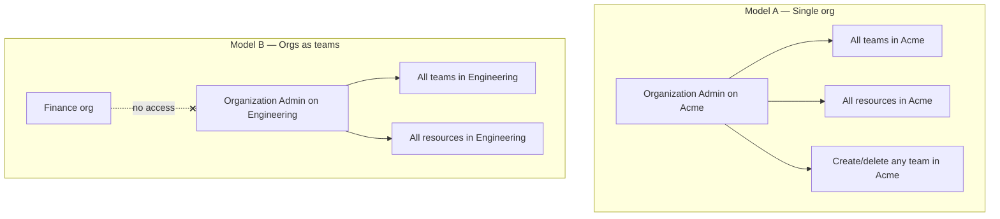
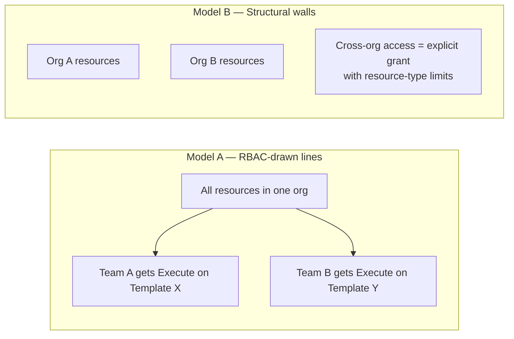
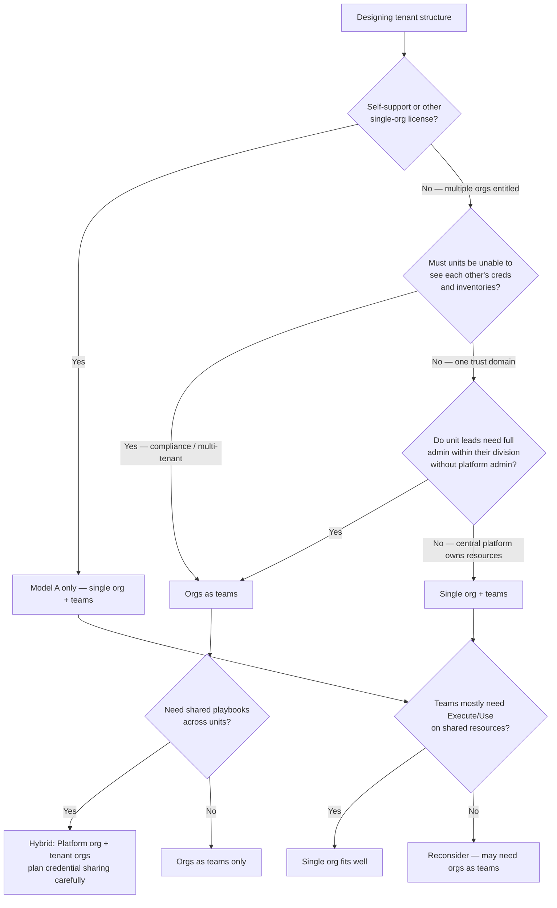

# AAP RBAC — Organizational Design: Single Org vs Orgs as Teams

A decision guide for choosing between **one organization with many teams** and **many organizations (each acting as a “team”) with teams underneath for finer grouping**.

**Audience:** Platform architects, RBAC admins, and anyone explaining tenant structure to stakeholders.

**Prerequisites:** [AAP-RBAC-GUIDE.md](AAP-RBAC-GUIDE.md) (orgs, teams, and role scopes)

**Related:** [AAP-RBAC-ROLE-HIERARCHY.md](AAP-RBAC-ROLE-HIERARCHY.md) · [AAP-RBAC-ROLE-PERMISSION-OVERLAPS.md](AAP-RBAC-ROLE-PERMISSION-OVERLAPS.md) · [AAP-RBAC-AGENT-CONTEXT.md](AAP-RBAC-AGENT-CONTEXT.md)

**Last validated:** 2026-06-05 against local forks of `django-ansible-base`, `awx`, `eda-server`, `galaxy_ng`, and `ansible-ui`.

---

## The decision in one sentence

> **Teams group people and bulk-assign roles inside an org; organizations define where resources live and where admin power stops.**

Choosing “single org + teams” vs “orgs as teams” is not a naming preference — it is a choice about **where the hard isolation boundary sits** and **how much power Organization Admin carries**.

---

## What AAP actually supports

Both models use the same object hierarchy:

- There is **no nested-team feature** — teams are always a flat list under one org (`ANSIBLE_BASE_ALLOW_TEAM_PARENTS = False` in AAP services).
- Each team belongs to **exactly one** organization.
- Teams **do not own** resources; they group users and receive role assignments (on objects, or at org scope).

```text
Organization   ← hard tenant boundary (resources live here)
  └── Team       ← grouping + bulk RBAC (one level only; one org per team)
  └── Team
  └── Team
```

When people say **“orgs as teams with sub-teams,”** they mean:

```text
Org "Engineering"              ← what would have been a top-level “team”
  ├── Team "Backend"
  ├── Team "Frontend"
  └── Team "Platform"

Org "Finance"                  ← another former top-level “team”
  ├── Team "Trading"
  └── Team "Compliance"
```

“Sub-teams” are ordinary **teams inside each org**. That capability exists in **both** models. What changes is **what sits at the org level** — one company-wide container, or one container per business unit.

---

## The two models side by side

### Model A — Single org with teams



All Controller and EDA resources belong to **Acme Corp**. Teams control **who gets which roles** on those shared objects — not which org namespace the objects live in.

### Model B — Orgs as teams



Each business unit **is** an org. Resources are structurally separated. Teams within each org provide the same bulk RBAC and roster grouping as in Model A.

---

## Comparison matrix

| Dimension | **Single org + teams** | **Orgs as teams** |
|-----------|------------------------|-------------------|
| **Structure** | 1 org → many teams | Many orgs → teams within each |
| **Resource home** | All automation objects share one org namespace | Each unit has its own org-scoped namespace |
| **Isolation** | **RBAC-only** — careful role assignment required | **Structural + RBAC** — org is the built-in wall |
| **Organization Admin** | Administers **all teams and all resources** in the company org | Administers **one business unit** only |
| **Team Admin** | Manages one team’s roster and settings (same in both models) | Same |
| **Accidental cross-access risk** | Higher — one shared resource pool | Lower — wrong role in Org A does not reach Org B |
| **Shared playbooks / credentials** | Easy — create once, assign teams in the same org | Harder — see [§6 Sharing content](#6-sharing-content-across-units); credentials have a strict same-org rule |
| **Per-unit limits** | One `max_hosts`, default EE, org instance groups for everyone | Per-org caps and execution settings |
| **Audit / chargeback** | Weaker natural boundary; filter by assignments | Strong natural boundary at org level |
| **Licensing** | Compatible with self-support per Red Hat product docs (single org) | Requires subscription entitlement for multiple orgs — confirm with your account team |

---

## The true differences (not just renaming)

### 1. Organization is the tenant boundary; team is a grouping mechanism

Red Hat defines an organization as *“the highest level object in the Ansible Automation Platform object hierarchy”* — a logical collection of users, teams, and resources.

| Object | What it owns | Isolation strength |
|--------|--------------|-------------------|
| **Organization** | Projects, inventories, credentials, job templates, workflows, EDA activations, notification templates, execution environment defaults | **Hard boundary** — resources belong to exactly one org |
| **Team** | Users (via Team Member) and inherited role assignments; can also hold **organization-level** roles | **Soft boundary** — groups people; does not own resources |

In **Model A**, calling something a “team” does **not** isolate its credentials or inventories from other teams. Those objects are still Acme Corp resources.

In **Model B**, each unit’s resources live in that unit’s org. Isolation is structural unless you explicitly grant cross-org access.

### 2. Organization Admin means different things

Organization Admin is the same role name in both models, but the **blast radius** depends on how many orgs you have:



From [AAP-RBAC-ROLE-PERMISSION-OVERLAPS.md](AAP-RBAC-ROLE-PERMISSION-OVERLAPS.md):

- **Organization Admin ⊃ Team Admin** for shared team permissions — but on **org scope**, not one team.
- Org Admin’s `shared.member_team` applies to **every team in that org**.

| Need | Model A approach | Model B approach |
|------|------------------|------------------|
| Unit lead runs their division without seeing others | Many **Team Admin** assignments + careful resource scoping; **avoid** Org Admin | **Organization Admin** on their org |
| Central IT owns everything | **Organization Admin** on the single org | Platform team as separate org or system admins |
| One team manager, one roster | **Team Admin** on that team | **Team Admin** on that team (identical) |

### 3. Team Admin behaves the same in both models

**Team Admin** always means:

- Manage membership on **this one team** (`shared.member_team`, `shared.change_team`)
- Edit or delete **this one team**
- Inherit roles assigned **to** this team

**Team Member** always means: be on the team and inherit its roles — not manage the roster.

The organizational model choice affects **who sits above Team Admin**, not Team Admin itself. See [AAP-RBAC-GUIDE.md](AAP-RBAC-GUIDE.md) — *Teams — the part that confuses everyone*.

### 4. Resource isolation: policy vs structure



In Model A, a credential created “for Ops” is still an org-wide object. A mis-assigned **Organization Credential Admin** or overly broad team role can expose it.

In Model B, Ops credentials live in Org Ops. Dev users have no path to them unless you deliberately share access (with constraints — see §6) or duplicate resources.

### 5. Two levels of structure, different isolation strength

| What you need to represent | Model A | Model B |
|----------------------------|---------|---------|
| Top-level division (Engineering vs Finance) | **Team** — weak isolation | **Org** — strong isolation |
| Subdivision (Backend vs Frontend within Engineering) | **Team** under Acme | **Team** under Org Engineering |

Model B gives you **two tiers with different isolation properties**: org = hard wall, team = soft grouping. Model A gives you **one hard wall** (the org) and everything else is teams with the same soft grouping.

### 6. Sharing content across units

**Model A — straightforward (same org)**

1. Create project/credential/inventory once in Acme.
2. Assign **Use** / **Execute** / **Admin** to the relevant teams (all in Acme).

**Model B — requires a deliberate pattern**

Cross-org sharing is **not one-size-fits-all**. Controller enforces extra rules on some resource types:

| Resource type | Cross-org team grant (normal admin) | Cross-org user grant (normal admin) | Typical workaround |
|---------------|-------------------------------------|-------------------------------------|-------------------|
| **Credentials** | **Blocked** — team must be in the credential’s org | **Blocked** — user must be a member of the credential’s org | Duplicate creds per org; or users in multiple orgs; superuser for exceptions |
| **Projects, job templates, inventories** | Often possible at the Gateway/DAB layer | User should be an org member of the resource’s org | Prefer multi-org users or a shared Platform org |
| **Execution environments** | Varies; org-scoped EEs require actor to have org access | User must have view access to the EE’s org | Duplicate or shared Platform org |

> **Code reference:** `awx/main/models/credential.py` — `validate_role_assignment` rejects granting credential access to a user or team not in the credential’s organization (superusers excepted).

| Pattern | When to use | Tradeoff |
|---------|-------------|----------|
| **Shared services org** (“Platform”) | Common playbooks, compliance templates, centrally managed projects | Tenant users join Platform org (Organization Member) and get narrow resource roles; credentials still need same-org team/user or duplication |
| **Duplicate resources** | SSH keys, vault creds, same Git repo per tenant | Simple mental model; more objects to maintain; strongest isolation |
| **Users in multiple orgs** | Same person works across units | Effective permissions = **union** of all role assignments; most reliable cross-org pattern |

Users **can** belong to multiple orgs and teams. Their effective access is the union of every granted role — this is by design, not a workaround.

**Do not assume** “grant tenant team Execute on Platform project” works for every resource type. For **secrets (credentials)**, plan duplication or multi-org membership — not cross-org team grants.

### 7. Per-org operational knobs

Each organization can have its own:

| Setting | Effect |
|---------|--------|
| `max_hosts` | Cap managed hosts for that org |
| Default execution environment | Default EE for job templates in the org |
| Instance groups (org-associated) | Dedicated execution capacity for jobs in that org |
| Instance groups (system-level) | Shared execution capacity; can be linked to orgs or job templates |

In Model A, org-level settings apply to **everyone** in the single org unless you use template-level instance groups or other workarounds.

In Model B, each tenant org can have independent caps and execution topology.

### 8. Automation Hub is org-agnostic in practice

Hub collections and namespaces are often scoped **globally** or to a **namespace object**, not to a Platform organization. Org choice does not fully solve content isolation for Hub — plan `galaxy.*` roles separately. See [AAP-RBAC-GUIDE.md](AAP-RBAC-GUIDE.md) — *Automation Hub*.

---

## Decision flowchart



---

## When to choose each model

### Choose single org + teams when

- One company or one trust domain; teams collaborate and share inventories, projects, and credentials.
- A central platform team creates and owns most resources; line teams mainly need **Execute**, **Use**, or narrow resource roles.
- You want simpler administration — fewer orgs, fewer cross-org grants, fewer duplicated objects.
- You are on **self-support** or another single-org license (per Red Hat subscription docs).
- Unit isolation is desirable but enforced by **process and RBAC**, not regulatory structure.

### Choose orgs as teams when

- True **multi-tenant** isolation — business units must not access each other’s automation objects.
- Unit leads need **Organization Admin**-level self-service (create teams, manage all resources in their unit) without involving platform admins.
- Per-unit **host limits**, **execution capacity**, or **compliance boundaries** align with org boundaries.
- Chargeback, audit scope, or regulatory scope maps cleanly to org.
- You have (or will have) **multiple-org licensing**.

### Hybrid pattern (common at scale)

Many enterprises use a **shared services org** plus **tenant orgs**:

```text
Org "Platform"
  └── Team "Hub Admins"
  └── Shared: compliance playbooks, vault lookup creds, monitoring projects

Org "Engineering"
  ├── Team "Backend"
  └── Team "Frontend"

Org "Operations"
  ├── Team "SRE"
  └── Team "Network"

Org "Finance"
  ├── Team "Trading"
  └── Team "Compliance"
```

Grant tenant **users** (in both tenant and Platform orgs) or **Platform-org teams** narrow **Use** / **Execute** on shared projects and templates. Keep **Organization Admin** scoped to each tenant org. For **credentials**, duplicate per org or use multi-org users — cross-org team grants on credentials are blocked for normal admins.

---

## RBAC patterns by model

### Delegating team roster management

Same in both models — assign **Team Admin**, not Team Member:

```text
User Jane  →  Team Admin  →  Team "Ops"
```

See the walkthrough in [AAP-RBAC-GUIDE.md](AAP-RBAC-GUIDE.md) — *“I want Jane to add and remove users on the Ops team”*.

> **External auth caveat:** When `MANAGE_ORGANIZATION_AUTH` is false (common with external SSO), Organization Admin may be blocked from team membership changes on Controller-backed teams. **Team Admin** on the specific team remains the reliable narrow fix. See [AAP-RBAC-AGENT-CONTEXT.md](AAP-RBAC-AGENT-CONTEXT.md).

### Delegating unit administration

| Model | Assignment | Scope |
|-------|------------|-------|
| A — single org | **Organization Admin** on Acme | Entire company org — use only when that breadth is intended |
| A — single org (narrow) | **Team Admin** on each unit’s team(s) + resource-scoped org roles | Per-team delegation without org-wide admin |
| B — orgs as teams | **Organization Admin** on Engineering | Full control inside Engineering only |

### Least-privilege resource access

Prefer assigning roles **to teams** (not individual users) at the **narrowest scope**:

| Scope | Example | Use when |
|-------|---------|----------|
| Object | Job Template Execute on one template | One-off access |
| Team + object | Team Deployers → Execute on Deploy App | Standard pattern in both models |
| Team + org | Team Operators → Organization Execute on Engineering | Bulk execute within one org |
| Org resource type | Organization Inventory Admin on Engineering | All inventories in one org |
| Org | Organization Admin | Full unit or company admin |

---

## Worked example: same company, two designs

**Scenario:** Acme has Engineering (Backend, Frontend) and Finance (Trading, Compliance). Each subdivision runs its own job templates and holds its own SSH keys.

### Model A — Single org

```text
Organization: Acme
  Team: Engineering-Backend
  Team: Engineering-Frontend
  Team: Finance-Trading
  Team: Finance-Compliance

Resources: all in Acme
  Credential "Backend SSH"     → Credential Admin to Engineering-Backend team
  Inventory "Trading hosts"    → Inventory Use to Finance-Trading team
  Job template "Deploy API"    → Execute to Engineering-Backend team
```

**Risk to manage:** Any **Organization Admin** on Acme sees everything. A broad org-level credential role exposes all teams’ secrets.

### Model B — Orgs as teams

```text
Organization: Engineering
  Team: Backend
  Team: Frontend
  Resources: Engineering projects, inventories, credentials

Organization: Finance
  Team: Trading
  Team: Compliance
  Resources: Finance projects, inventories, credentials
```

**Delegation:** Engineering lead gets **Organization Admin on Engineering** — full self-service inside Engineering, zero visibility into Finance.

**Sharing (compliance playbook in Org Platform):**

- Add Finance users as **Organization Members** of Platform, then grant **Project Use** on the shared project — most reliable pattern.
- Or duplicate the project in Finance — simplest isolation, more maintenance.
- Do **not** grant Platform **credential** access to Finance teams/users who are not in Platform’s org (Controller blocks this for normal admins).

---

## Common misconceptions

| Misconception | Reality |
|---------------|---------|
| “Teams isolate resources” | **Organizations** isolate resources. Teams isolate **who gets roles**. |
| “We can nest teams” | No. One flat team list per org. “Sub-teams” = teams inside an org-as-team. |
| “Organization Member gives access” | No. Membership marker only — pair with team or resource roles. |
| “Org Admin on Acme = Org Admin on Engineering” | Same role **name**, different **blast radius** depending on model. |
| “Orgs as teams means we don’t need teams” | Still use teams within each org for roster bulk-assignment and least privilege. |
| “Moving from Model A to B later is easy” | Reorganizing tenant structure is hard — **design early**. |
| “Cross-org team grants share everything” | **Credentials** require same-org team/user (unless superuser). Projects/templates are more flexible; plan per resource type. |
| “Each team can span orgs” | No. Every team has exactly one parent organization. |

---

## Migration and licensing notes

| Topic | Detail |
|-------|--------|
| **Self-support license** | Per Red Hat product documentation: default org only; you must not delete it; additional orgs are not available. Model B is not an option. *(Enforced by subscription/licensing, not by RBAC engine code alone.)* |
| **Standard / enterprise** | Multiple orgs supported per subscription; confirm entitlement with your account team. |
| **Managed default org** | The UI blocks deletion of **system-managed** organizations (`organization.managed`). This applies regardless of license tier. |
| **Reorganization cost** | Resources belong to orgs. Splitting one org into many requires moving or recreating objects and reassigning roles. |
| **External auth** | LDAP/SAML can map directory groups to orgs and teams. Org-as-teams maps cleanly to “one AD group → one org admin.” See Red Hat access management docs for `AUTH_LDAP_ORGANIZATION_MAP` / SAML team org map. |
| **Users spanning orgs** | Supported. Effective permissions are the **union** of all role assignments across orgs and teams. |

---

## Quick reference — explain it to stakeholders

**Elevator pitch (Model A):**  
*“We run one automation estate. Teams are how we group people and assign access to shared projects and credentials.”*

**Elevator pitch (Model B):**  
*“Each business unit gets its own automation estate with its own admin. Teams inside each unit handle day-to-day roster and job access.”*

**One-liner for architects:**  
*“Put the isolation boundary at the org if units must not share resources; put it at RBAC if they should.”*

---

## Related documents

| Document | Why read it |
|----------|-------------|
| [AAP-RBAC-GUIDE.md](AAP-RBAC-GUIDE.md) | Orgs, teams, role scopes, common mistakes |
| [AAP-RBAC-ROLE-HIERARCHY.md](AAP-RBAC-ROLE-HIERARCHY.md) | Full role tree and Org Admin permission breakdown |
| [AAP-RBAC-ROLE-PERMISSION-OVERLAPS.md](AAP-RBAC-ROLE-PERMISSION-OVERLAPS.md) | Org Admin vs Team Admin subset relationships |
| [AAP-RBAC-AGENT-CONTEXT.md](AAP-RBAC-AGENT-CONTEXT.md) | Goal → role lookup for implementation |
| [AAP-RBAC-MANAGED-ROLES-CATALOG.md](AAP-RBAC-MANAGED-ROLES-CATALOG.md) | Exact permissions per managed role |

Official Red Hat documentation: *Managing access with role-based access control* (Gateway / access management) — organizations and teams chapters.
