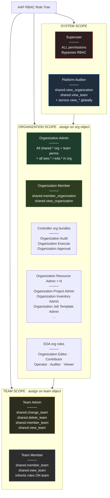
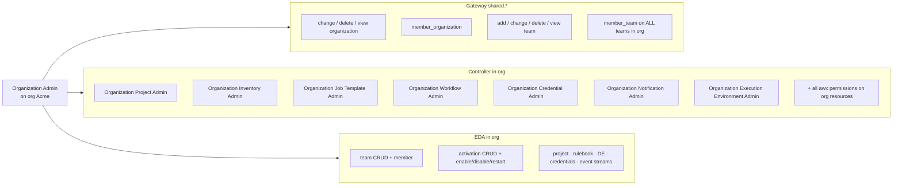
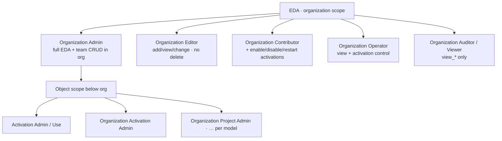

# AAP RBAC Role Hierarchy

A **breadth-first role tree**: widest access at the top, narrowest at the bottom. Use this to see how roles relate by **scope and power**, not as an inheritance chain (assigning Org Admin does not automatically grant Team Admin on every team — you assign roles separately on each object).

**Related:** [AAP-RBAC-GUIDE.md](./AAP-RBAC-GUIDE.md) (narrative) · [AAP-RBAC-AGENT-CONTEXT.md](./AAP-RBAC-AGENT-CONTEXT.md) (lookup tables)

---

## How to read this tree

| Symbol / layout | Meaning |
|-----------------|--------|
| Indentation / branches | **Narrower scope** or **subset of permissions** (conceptually below) |
| `shared.*` | Gateway org/team permissions |
| `awx.*` | Controller permissions |
| `eda.*` | EDA permissions |
| `galaxy.*` | Hub permissions |
| **Bold role names** | Managed (built-in) roles |
| *Italic patterns* | Auto-generated per resource type |

**Not shown:** Custom roles you create, legacy Controller implicit names (`admin_role`, `read_role`), superuser-equivalent Gateway service accounts.

---

## Master tree (text)

Copy-friendly file-tree view of the full hierarchy:

```text
AAP RBAC
│
├── SYSTEM SCOPE (entire installation)
│   │
│   ├── Superuser
│   │   └── • ALL permissions — RBAC checks bypassed
│   │
│   ├── Platform Auditor                    [content_type: null]
│   │   ├── shared.view_organization
│   │   ├── shared.view_team
│   │   └── + all registered view_* per service (awx, eda, galaxy, …)
│   │
│   └── System Auditor                      [Controller; legacy name, same intent as auditor]
│       └── view_* across registered models
│
├── ORGANIZATION SCOPE (one org object)
│   │
│   ├── Organization Admin                [shared.organization]
│   │   ├── Gateway / shared
│   │   │   ├── shared.change_organization
│   │   │   ├── shared.delete_organization
│   │   │   ├── shared.member_organization
│   │   │   ├── shared.view_organization
│   │   │   ├── shared.add_team
│   │   │   ├── shared.change_team
│   │   │   ├── shared.delete_team
│   │   │   ├── shared.member_team          ← manage ALL teams in org
│   │   │   └── shared.view_team
│   │   │
│   │   ├── Controller (all awx.* in org)
│   │   │   ├── Organization Project Admin
│   │   │   ├── Organization Inventory Admin
│   │   │   ├── Organization Job Template Admin
│   │   │   ├── Organization Workflow Job Template Admin
│   │   │   ├── Organization Credential Admin
│   │   │   ├── Organization Notification Admin
│   │   │   ├── Organization Execution Environment Admin
│   │   │   └── + all other org-child resource permissions
│   │   │
│   │   └── EDA (all eda.* in org)
│   │       └── full CRUD + member on team, activation, project, …
│   │
│   ├── Organization Member               [shared.organization]
│   │   ├── shared.member_organization      ← member OF org (inherit org roles)
│   │   └── shared.view_organization
│   │
│   ├── Organization Audit                [Controller bundle]
│   │   ├── audit_organization
│   │   └── view_* on all org resources
│   │
│   ├── Organization Execute              [Controller bundle]
│   │   ├── execute_jobtemplate
│   │   ├── execute_workflowjobtemplate
│   │   └── view_* on runnable resources
│   │
│   ├── Organization Approval             [Controller bundle]
│   │   ├── approve_workflowjobtemplate
│   │   └── view_organization, view_workflowjobtemplate
│   │
│   ├── Organization {Resource} Admin     [Controller; one per resource type]
│   │   ├── Organization Project Admin
│   │   ├── Organization Inventory Admin
│   │   ├── Organization Job Template Admin
│   │   ├── Organization Workflow Job Template Admin
│   │   ├── Organization Credential Admin
│   │   ├── Organization Notification Template Admin
│   │   └── Organization Execution Environment Admin
│   │
│   └── EDA organization roles            [eda.organization]
│       ├── Organization Editor
│       ├── Organization Contributor
│       ├── Organization Operator
│       ├── Organization Auditor
│       └── Organization Viewer
│
├── TEAM SCOPE (one team object)
│   │
│   ├── Team Admin                        [shared.team]
│   │   ├── shared.change_team
│   │   ├── shared.delete_team
│   │   ├── shared.member_team              ← add/remove users ON this team
│   │   └── shared.view_team
│   │   └── inherits all roles assigned TO this team
│   │
│   └── Team Member                       [shared.team]
│       ├── shared.member_team              ← user IS on team; inherits team roles
│       └── shared.view_team
│
├── OBJECT SCOPE — Controller             [awx.* on one resource]
│   │
│   ├── Per resource type (× each instance: project, inventory, job template, …)
│   │   │
│   │   ├── {Resource} Admin
│   │   │   └── change, delete, view, use, execute, … (all except add on type)
│   │   │
│   │   └── {Resource} {Action}           [special actions + view]
│   │       ├── Job Template Execute
│   │       ├── Workflow Job Template Execute
│   │       ├── Workflow Job Template Approve
│   │       ├── Inventory Use
│   │       ├── Inventory Update
│   │       ├── Inventory Ad Hoc
│   │       ├── Project Use
│   │       ├── Project Update
│   │       └── Credential Use
│   │
│   └── Instance Group Admin              [no org parent — global/object only]
│
├── OBJECT SCOPE — EDA                    [eda.* on one resource]
│   │
│   ├── {Resource} Admin                  [e.g. Activation Admin]
│   └── {Resource} Use                    [e.g. Activation Use]
│
└── OBJECT / GLOBAL SCOPE — Hub           [galaxy.*]
    │
    ├── Global (model-wide)
    │   ├── galaxy.content_admin
    │   ├── galaxy.collection_admin
    │   ├── galaxy.collection_publisher
    │   ├── galaxy.collection_curator
    │   ├── galaxy.execution_environment_admin
    │   ├── galaxy.execution_environment_publisher
    │   ├── galaxy.user_admin
    │   ├── galaxy.group_admin
    │   ├── galaxy.task_admin
    │   └── galaxy.auditor / Platform Auditor
    │
    └── Object (namespace, synclist, …)
        ├── galaxy.collection_namespace_owner
        ├── galaxy.execution_environment_namespace_owner
        ├── galaxy.execution_environment_collaborator
        ├── galaxy.synclist_owner
        └── galaxy.ansible_repository_owner
```

---

## Diagram 1 — System → Organization → Team

Top of the tree: who can touch the **whole platform**, one **org**, or one **team**.



---

## Diagram 2 — Organization Admin expanded

What **Organization Admin** effectively includes (Gateway shared permissions + “everything in org” for registered services).



---

## Diagram 3 — Team roles under an organization

Teams live **inside** an org. Team roles are assigned on the **team object**, not inherited from Org Admin automatically.

```mermaid
flowchart TB
    ORG["Organization: Acme"]

    ORG --> OA["Organization Admin on Acme<br/>CAN manage all teams"]
    ORG --> OM["Organization Member on Acme<br/>member of org only"]

    ORG --> T1["Team: Ops"]
    ORG --> T2["Team: Dev"]

    T1 --> TA1["Team Admin on Ops<br/>member_team · change_team"]
    T1 --> TM1["Team Member on Ops<br/>member_team only"]
    T1 --> TR1["Roles assigned TO Ops team<br/>e.g. Job Template Execute"]

    TM1 -.->|inherits| TR1
    TA1 -.->|inherits| TR1

    T2 --> TA2["Team Admin on Dev"]
    T2 --> TM2["Team Member on Dev"]

    style OA fill:#1f3d2d,stroke:#3e8635
    style TA1 fill:#2d2d1f,stroke:#f0ab00
    style TM1 fill:#2d2d2d,stroke:#8a8
```



---

## Diagram 4 — Controller object roles (narrowest)

Below org- and team-level roles: permissions on **one** Controller resource.

```mermaid
flowchart TB
    ROOT["Controller object scope"]

    ROOT --> JT["Job Template"]
    ROOT --> WF["Workflow Job Template"]
    ROOT --> INV["Inventory"]
    ROOT --> PRJ["Project"]
    ROOT --> CRE["Credential"]
    ROOT --> IG["Instance Group"]

    JT --> JTA["Job Template Admin"]
    JT --> JTE["Job Template Execute"]

    WF --> WFA["Workflow Job Template Admin"]
    WF --> WFE["Workflow Job Template Execute"]
    WF --> WFP["Workflow Job Template Approve"]

    INV --> INVA["Inventory Admin"]
    INV --> INVU["Inventory Use"]
    INV --> INVUP["Inventory Update"]
    INV --> INVAD["Inventory Ad Hoc"]

    PRJ --> PRJA["Project Admin"]
    PRJ --> PRJU["Project Use"]
    PRJ --> PRJUP["Project Update"]

    CRE --> CREA["Credential Admin"]
    CRE --> CREU["Credential Use"]

    IG --> IGA["Instance Group Admin<br/>not org-scoped"]
```



---

## Diagram 5 — EDA organization roles (sibling to Controller bundles)

EDA managed org roles (narrower than Organization Admin):



---

## Diagram 6 — Hub roles (parallel branch)

Hub content roles sit **beside** org/team Gateway roles — often **global** or **namespace** scoped.

```mermaid
flowchart TB
    HUB["Automation Hub roles"]

    HUB --> GLOBAL["Global model roles"]
    HUB --> OBJECT["Object roles"]

    subgraph GLOBAL
        direction TB
        G1["galaxy.content_admin"]
        G2["galaxy.collection_admin"]
        G3["galaxy.collection_publisher"]
        G4["galaxy.collection_curator"]
        G5["galaxy.execution_environment_admin"]
        G6["galaxy.user_admin"]
        G7["galaxy.group_admin"]
        G8["galaxy.task_admin"]
    end

    subgraph OBJECT
        direction TB
        O1["galaxy.collection_namespace_owner"]
        O2["galaxy.execution_environment_namespace_owner"]
        O3["galaxy.execution_environment_collaborator"]
        O4["galaxy.synclist_owner"]
        O5["galaxy.ansible_repository_owner"]
    end
```



---

## Breadth comparison (single glance)

| Level | Role | Breadth |
|-------|------|---------|
| 1 | **Superuser** | Entire platform, all actions |
| 2 | **Platform Auditor** | Entire platform, read-only |
| 3 | **Organization Admin** | One org, all services + all teams in org |
| 4 | **Organization {Service} Admin** | One org, one resource type (e.g. all inventories) |
| 5 | **Organization Execute / Audit / Approval** | One org, one Controller capability bundle |
| 6 | **EDA Organization Editor / Contributor / …** | One org, subset of EDA actions |
| 7 | **Team Admin** | One team + its membership |
| 8 | **Team Member** | One team, inherit team’s resource roles |
| 9 | **{Resource} Admin** | One object, full control |
| 10 | **{Resource} Execute / Use / …** | One object, one action |

---

## Controller resource types in this tree

Registered with DAB in Controller (`awx/main/models/__init__.py`):

| Resource | Object Admin | Org-level Admin | Special action roles |
|----------|--------------|-----------------|----------------------|
| Project | Project Admin | Organization Project Admin | Use, Update |
| Inventory | Inventory Admin | Organization Inventory Admin | Use, Update, Ad Hoc |
| Job Template | Job Template Admin | Organization Job Template Admin | Execute |
| Workflow Job Template | Workflow Job Template Admin | Organization Workflow Job Template Admin | Execute, Approve |
| Credential | Credential Admin | Organization Credential Admin | Use |
| Notification Template | Notification Template Admin | Organization Notification Template Admin | — |
| Execution Environment | Execution Environment Admin | Organization Execution Environment Admin | — |
| Instance Group | Instance Group Admin | *(none — not org child)* | — |

---

## Quick mapping: “I need the smallest branch”

| Goal | Branch to use |
|------|----------------|
| Manage entire platform | SYSTEM → Superuser |
| Read entire platform | SYSTEM → Platform Auditor |
| Admin one business unit | ORG → Organization Admin |
| Manage one team’s roster | TEAM → Team Admin |
| Be on a team | TEAM → Team Member |
| Run one job | OBJECT Controller → Job Template Execute |
| Admin all inventories in org | ORG → Organization Inventory Admin |
| Publish to one namespace | Hub OBJECT → collection_namespace_owner |

---

## Source references

| Layer | Upstream source |
|-------|-----------------|
| Shared managed roles | `django-ansible-base/ansible_base/rbac/managed.py` |
| Gateway fixture | `ansible-ui/platform/.../roleDefinitions.json` |
| Controller managed roles | `awx/awx/main/migrations/_dab_rbac.py` |
| EDA org roles | `eda-server/.../create_initial_data.py` → `ORG_ROLES` |
| Hub roles | `galaxy_ng/.../0029_move_perms_to_roles.py` |

When AAP upgrades, re-check managed roles in the UI or via `GET /api/gateway/v1/role_definitions/`.
